## Step 1: Create RStudio Project and example.qmd

I created a new RStudio Project called `git-guide` to serve as the working 
directory for this assignment. Inside the project, I created a Quarto file 
called `example.qmd` with the following structure:

A YAML header specifying the title, author, and HTML output format
An Introduction section with a brief description
A simple R code chunk computing `1 + 1`

The file was rendered to HTML using the Render button in RStudio, confirming 
that the document knits successfully. The screenshot below shows both the 
source code and the rendered output side by side.

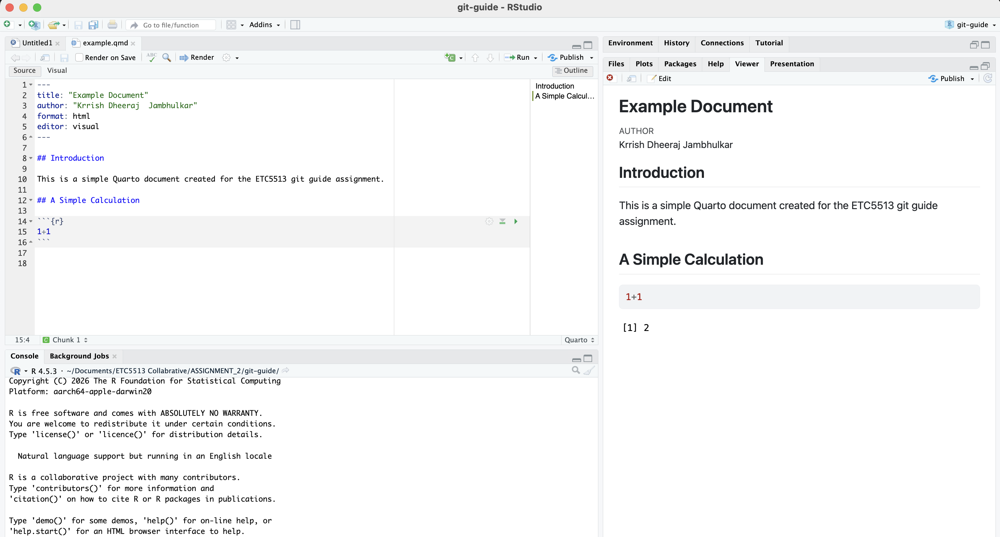

## Step 2: Initialise Git and Push to GitHub

The `git-guide` project folder was initialised as a Git repository using 
`git init`. Before staging any files, a `.gitignore` file was created to 
prevent unnecessary files such as `.Rproj.user/`, `.DS_Store`, and rendered 
output files from being tracked by Git. This keeps the repository clean and 
focused on source files only.

All relevant files were staged using `git add .` and committed with a 
descriptive message. A new empty repository called `git-guide` was then 
created on GitHub. The local repository was linked to the remote using 
`git remote add origin`, and the commits were pushed using 
`git push -u origin main`. The `-u` flag sets the upstream so future pushes 
only require `git push`.

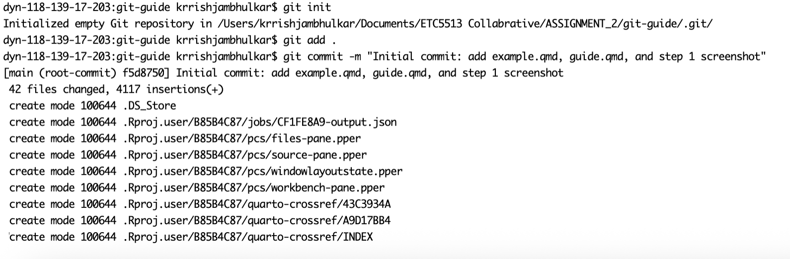

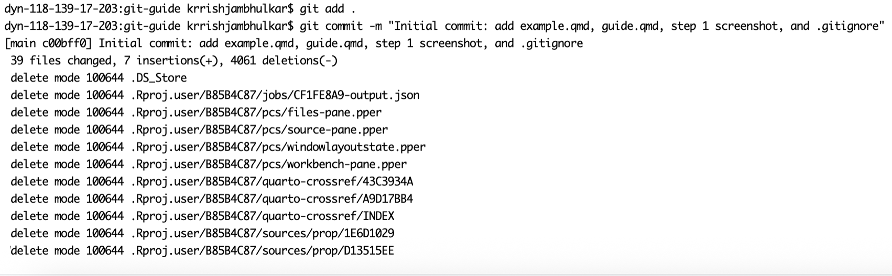

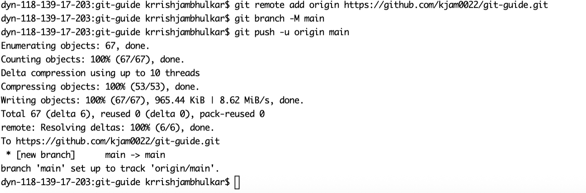

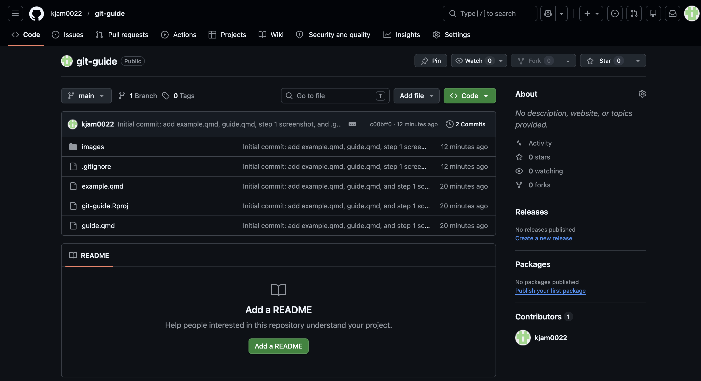

## Step 3: Create testbranch and Push changes

A new branch called `testbranch` was created and switched using `git checkout -b testbranch`. The `-b` creates the branch and switches into it in one single command. Branching allows us to work on changes independently without affecting the `main` branch

`example.qmd` was modified by adding a new section. The changes were staged/added using `git add example.qmd` and commited with a descriptive message which explains the modification. The branch was pushed to the remote repository using `git push -u origin testbranch` to make it visible on github

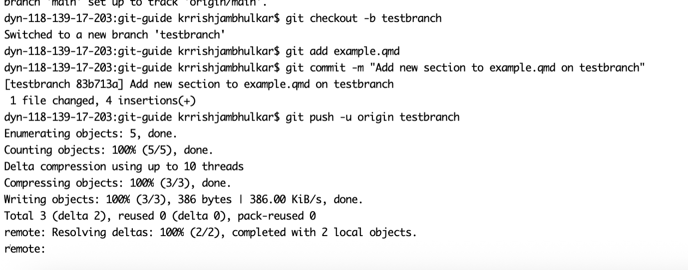

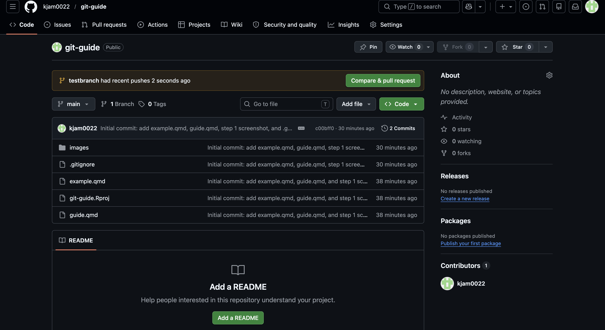

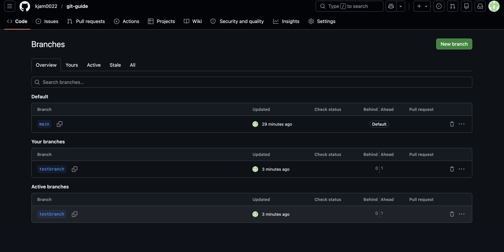

## Step 4: Add Data Folder and Amend Previous Commit

A folder called `data` was created in the project directory and the data files from Assignment 1 were added to it. Instead of commenting and staging this change, we used `git commit --amend` to add the data folder in our previous commit. This is useful when you realise you forgot to include a file or want to slightly edit the
last commit or made a typo in the last commit and want to keep the history clean.

Since ammeding re-writes the commit history a normal `git push` would be rejected by remote. Thus `git push --force` was used to overwrite the old commit on the remote with the appended one. It is safe to do on a branch where no one else is working. 

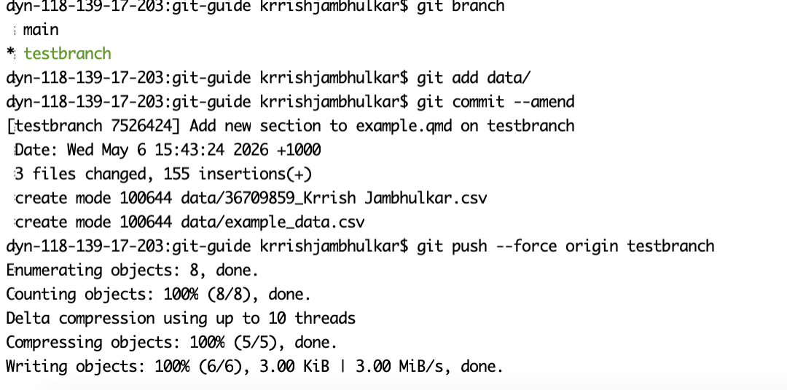

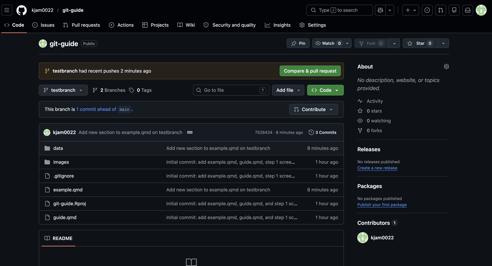

## Step 5: Create a Conflicting edit on main 

Switched back to `main` branch using `git checkout main`. A new section was added to `example.qmd` which is the same location as section added on `testbranch`, however with different content. This will intentionally create a conflict that will appear while merging `testbranch` into `main`.

The changes were staged/added using `git add example.qmd`, commited with a descriptive message and pushed to remote using `git push origin main`

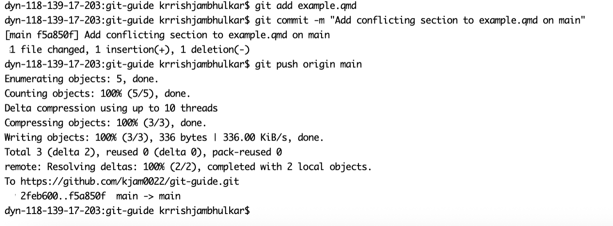
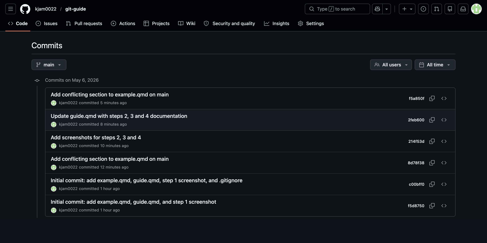

## Step 6: Merge Testbranch into Main and Resolve Conflict 

Both the branches contained different edits but at the same section of `example.qmd`. By merging `testbranch` into `main` using `git merge testbranch` caused a merge conflict. Git cannot decide which version to keep when same lines are edited on two different branches

The conflict markers (`<<<<<<<`, `=======`, `>>>>>>>`) were visible inside the `example.qmd` showcasing both versions( version 1: main, version 2: testbranch). The conflict was resolved by manually editing the file, removing conflict markers and replacing the versions with a single clean section. The resolved files were then stagged, commited and pushed to remote repository 

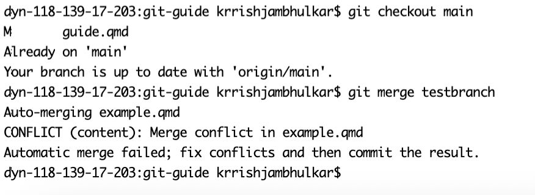

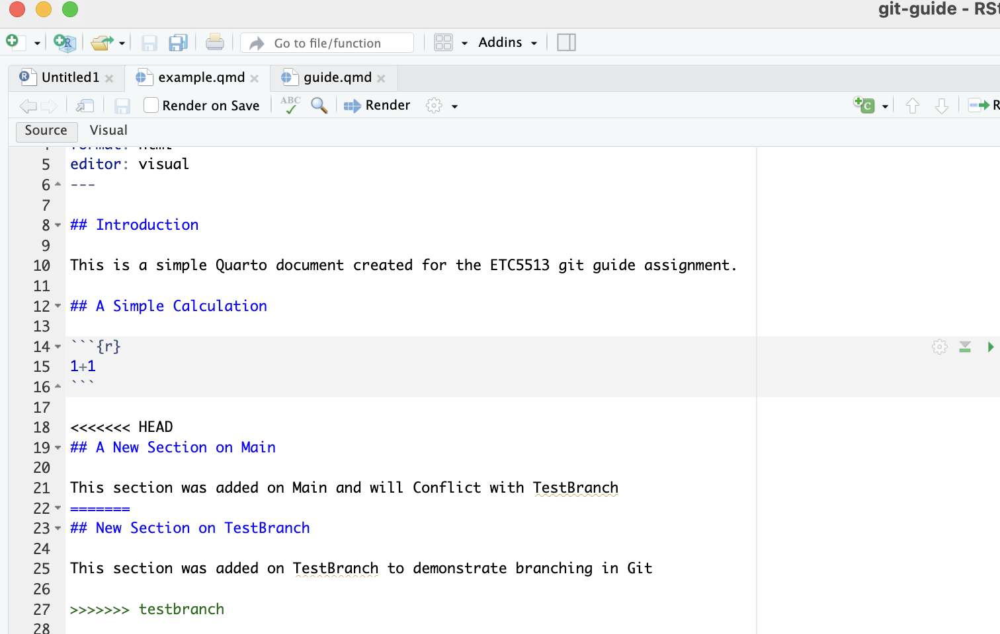

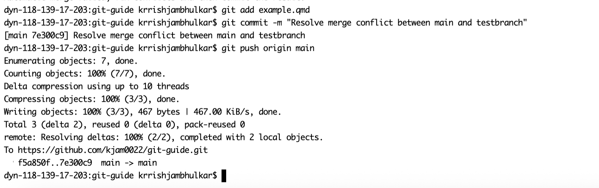

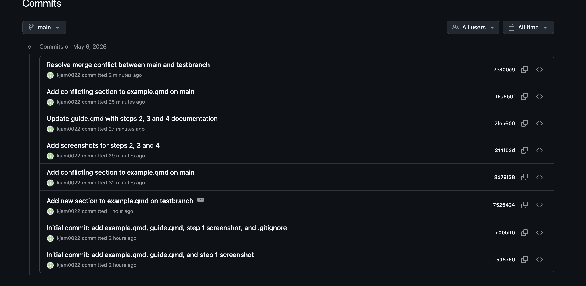

## Step 7: Tag Commit v1.0 on Main 

Created an annoted tag on `main` called as `v1.0` using `git tag -a`. Annoted tags stores extra metadata like the mail, date and tagger name makinmg it more descriptive and informative than lightweight tags. This tag marks the point were merge conflict was resolved. The tag was pushed to remote repository using `git push origin v1.0` 

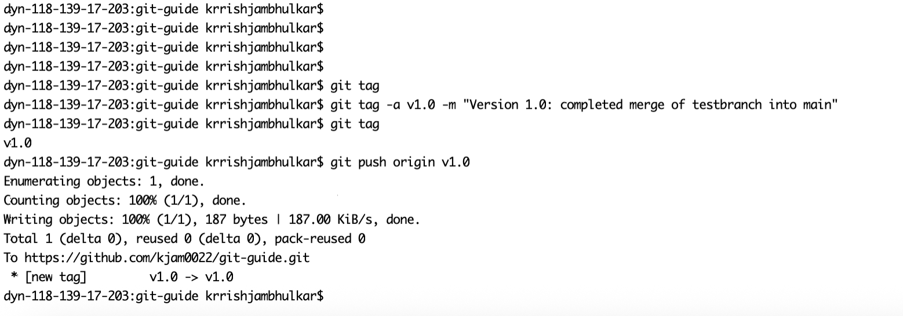

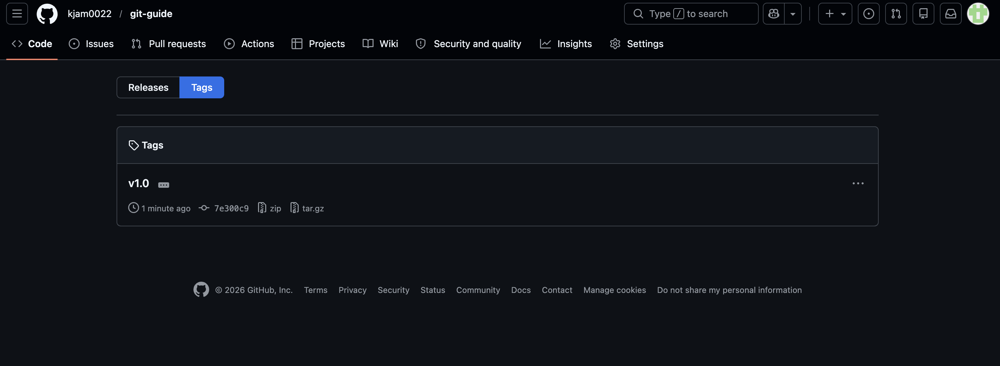

## Step 8: Delete testbranch Locally and on Remote

`testbranch` was successfully deleted when it was no longer needed using `git branch -d` locally the `-d` flag ensure the branch is safely deleted. The branch `testbranch` was also deleted from remote repository since it was no longer needed in remote as well using `git push origin --delete testbranch`. This keeps the remote repository clean and does not create any confusions later 

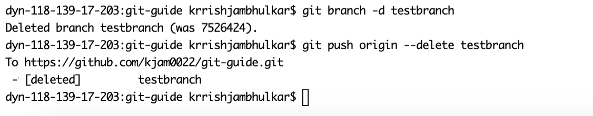

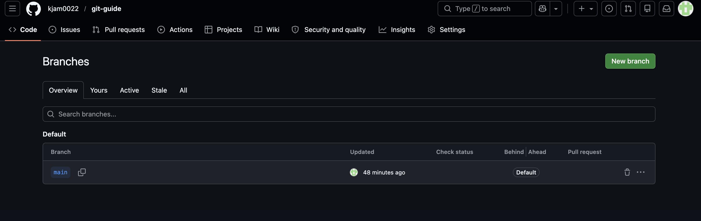

## Step 9: Commit log in Condensed Form

`git log --oneline` was used in order to display all the commits in condensed form. The command displays each commit in a single line with hash code and commit message, making it easy to get a glimpse of the entire project history. The output also shows were `HEAD`, `main`, `origin/main`, and the `v1.0` tag are pointing 

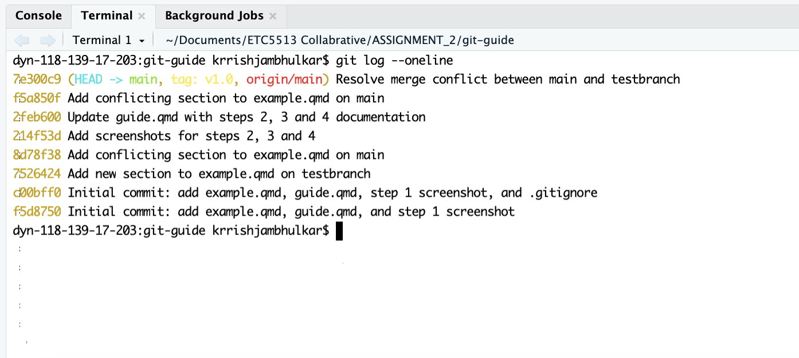

